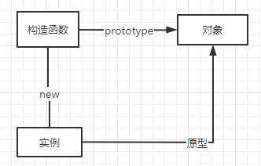
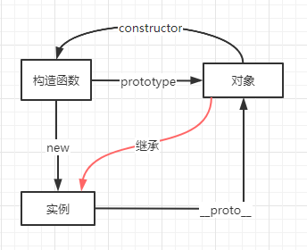

# 对象的创建

**首先需要知道的是使用原型的继承模式进行创建对象的意义，虽然可以使用 Object 构造函数或对象字面量可以方便地创建对象，但是这些方式在创建具有同样接口的多个对象时需要重复编写很多代码。然后需要知道的是 ECMAScript6 开始支持类和继承，但是ES6 的类更像是封装了 ES5.1 构造函数加原型继承的语法糖而已**

## 1 工厂模式

封装一个函数，接收对象所需的参数，return 一个对象

```js
function creatPerson(name, age, job) {
    let o = new Object();
    o.name = name;
    o.age = age;
    o.job = job;
    o.getName = function () {
        console.log(this.name);
    };
    return o;
}

const obj1 = creatPerson('hh', 112, 'worker');
console.log(obj1);
```

`obj1` 打印结果如下


## 2 构造函数模式

使用构造函数模式，上边的例子可以这样写

```js
function Person (name, age, job) {
    this.name = name;
    this.age = age;
    this.job = job;
    this.getName = function () {
        console.log(this.name);
    };
}

const person1 = new Person('dianli', 22, 'worker');
person1.getName(); // 'dianli'
```

使用 new 操作符调用构造函数会执行如下操作。

1. 在内存中创建一个新对象

2. **新对象的 `[[Prototype]]` 特性会被赋值为构造函数的 `prototype`**<br>
    *后续会详细讨论对象的原型继承*

3. **构造函数内部的 `this` 被赋值为这个新对象，即 `this` 指向新对象**<br>
    *此时只是 `this` 指向了新对象，还未通过 `this` 来对新对象进行修改*

4. **执行构造函数内部的代码（给新对象添加属性）**<br>
    **3、4 步说明*并不是说新对象继承了构造函数的属性，而是这些属性在进行 new 操作时被直接赋予了新的对象***

5. 如果构造函数返回非空对象，则返回该对象；否则，返回刚创建的新对象。

第5步示例代码如下

```js
function Person() {
    this.name = 'dianli1';
    return {
        name: 'dianli2',
    };
}

const person1 = new Person();
console.log(person1.name); // dianli2
```

### 2.1 构造函数也是函数

构造函数除了可以通过被 `new` 出来，还能直接调用，因为他就是不同的函数。在被调用是其中的 `this` 指向调用时的上下文。例如：

```js
function Person() {
    this.name = 'dianli';
}
Person(); // 这里直接调用，this 指向 全局作用域 window
console.log(window.name); // 'dianli'

const o = new Object();
Person.call(o); // Person 的 this 指向了对象 o
console.log(o.name); // 'dianli'
```

## 2.2 构造函数的问题

```js
function Person () {
    this.getName = function () {
        console.log('one function');
    };
}

const person1 = new Person();
const person2 = new Person()
person1.getName(); // 'dianli'
person2.getName(); // 'dinali'
```

构造函数内部定义的方法会在每个实例上创建一次，换言之，每个实例上都有一个方法，而且这个方法的所要实现的东西是一样的。在上述代码中，person1 和 person2 内都有一个 getName 的方法。而且这两个不同实例上的函数虽然同名却不相等。

```js
cosole.log(person1.getName == person2.getName); // false
```

为了解决这个相同逻辑的函数重复定义的问题，可以把这个函数定义在构造函数外部，在构造函数内部定义个方法来指向外部的函数。

```js
function Person () {
    this.gerName = getName();
}

getName = function () {
    console.log('one function');
};

const person1 = new Person();
const person2 = new Person()
person1.getName(); // 'dianli'
person2.getName(); // 'dinali'
```

**这样似乎解决了构造函数的问题，但是却带来了新的问题，那就是全局作用域被污染了**
也许你会想到不把函数定义在全局作用域内，而是定义在一个对象内

```js
const obj = {
    getName: function() {
        console.lgo('one function');
    }
}
```

嗯，看起来似乎完美解决了这个问题。但是即使是把方法定义在一个新对象内，也会随着方法和构造函数的增多而显得冗余杂乱，而且还需要我们手动再去创建一个对象。

## 2 原型模式

通过上一章可以了解到，使用构造函数主要是让实例继承了属性和方法，然后为了解决重复创建的问题还需要在外部作用域内定义一个方法。那么如果有没有一种方式**既可以实现属性和方法的继承，又可以不需要外部作用域中定义方法呢？**

每个函数都会创建一个 `prototype` 属性，这个属性是一个对象，这个对象包含了可以被实例共享的属性和方法。实际上，这个 `prototype` 对象就实例的**原型**。



```js
function Person() {
    Person.prototype.name = 'dianli';
    Person.prototype.sayName = function() {
        consoole.log(this.name);
    };

    let person1 = new Person();
    person1.sayName(); // dianli

    let person2 = new Person();
    console.log(person1.sayName == person2.sayName); // true
}
```

**注意这里和构造函数的不同，不同实例的 `sayName` 是相等的，**使用这种原型模式定义的属性和方法是由所有实例共享的。

### 2.1 理解原型

只要创建一个函数，这个函数就会被创建一个 `prototype` 属性，这个属性指向原型对象。然后这个原型对象会有一个 `constructor` 属性，再指会到这个函数。

```js
function Person() {};

console.log(Person.prototype);
// {
//     constructor: f Person(),
//     __proto__: Object // 这个Object是说这个属性是个对象，而不是说指向 Object
// }
```

打印函数的原型发现除了 `contructor` 属性外，还有一个 `__proto__` 的属性，这个属性指向 **Object 的原型对象**,所以这个函数会继承 Object 上的属性和方法，当然后续会详细说明对象的继承，这里简单说就是**实例的 `__proto__` 指向构造函数的 `prototype` 属性，而实例会通过 `__proto__` 来继承构造函数的 `prototype` 上的属性和方法。**



*脚本中没有访问这个[[Prototype]]特性的标准方式，但Firefox、Safari和Chrome会在每个对象上暴露__proto__属性，通过这个属性可以访问对象的原型。*

### 2.2 原型的层级

构造函数的原型中可以定义属性，实例也可以定义属性，但是实例中的属性会把原型中的同名属性覆盖掉，只是因为查找属性时是顺着原型链从下往上查找，一旦找到属性就不会再向上寻找了。除非把实例上的属性使用 `delete` 操作符进行删除。
`hasOwnProperty` 方法可以查看当前属性是否为实例属性

```js
function Person() {
    Person.prototype.name = "dianli";
}

const person1 = new Person();
person1.name = 'dianligegege';
console.log(person1.name); // dianligegege
console.log(person1.hasOwnProperty('name')); // true

const person2 = new Person();
console.log(person2.name); // dianli 来自原型

delete person1.name; // 删除实例同名属性
console.log(person1.name); // dianli
```

## 2.3 其他原型语法

在上边的写法中，每次修改 prototype 的属性就需要写一遍 `Person.prototype`，除了这种写法，还可以这样：

```js
function Person() {};

Person.prototype = {
    name: 'dianli',
};
 
```

这样写相当于重构了 Person 的原型对象，所以原型中默认带有的 contructor 属性就没有了。如果手动给添加上 contructor 属性呢

```js
function Person() {};
Person.prototype = {
    name: 'dianli',
    contructor: Person,
}
```

这样虽然获得了 contructor 属性，不过这样会使得 contructor 的 `[[Enumerable]]` 为true,这样contructor 属性就变得可以枚举了。

我们可以使用 Object.defineProperty() 方法类定义 constructor 属性。

```js
Object.defineProperty(Person.prototype, 'contructor', {
    enumerable：false,
    value: Person,
})
```

## 2.4 原型的动态性

从原型上搜索值是动态的，所以修改原型会在实例上反映出来

```js
let friend = new Person();
Person.prototype.goAway = function() {
    console.log('bye');
}

friend.goAway(); // bye
```

上面的方法是**在创建实例之后**修改原型的属性，那如果**在创建实例之后**直接重新写构造函数的原型呢？

```js
function Person() {};

let friend = new Person();

Person.prototype = {
    goAway () {
        console.log('bye');
    }
}

friend.goAway(); // 报错
```

可以看到，这时实例调用就无法再使用原型上的方法和属性了，这是因为实例指向的还是之前的原型对象，而之前的对象不存在这个方法。（所以Person.prototype = {} 这样写是在内存中新创建了一个对象？）

```js
function Person() {};

Person.prototype = {
    goAway () {
        console.log('hi');
    }
}

let friend = new Person();

Person.prototype = {
    goAway () {
        console.log('bye');
    }
}

let friend2 = new Person();

friend.goAway(); // hi

friend.goAway(); // bye
```

上面这样写更加印证了我们的猜想，重写原型之前构造的实例调用的还是之间旧的原型的方法，而在重写原型之后创建的实例调用的就是新的原型上的方法。

## 2.5 原型的问题

1. 弱化了向构造函数传递参数，想要传递参数的话构造函数的写法就必须是在内部定义单个属性的方法。

    ```js
    function Person(name) {
        Person.prototype.name = name;
    }

    const one = new Person('dianli');
    console.log(one.name); // 'dianli'
    ```

2. 最重要的是原型的所有属性是在实例间共享的

    还记得我们弃用构造函数而选择原型的原因吗？没错就是方法在所有实例共享这个优点。现在这个优点反而变为了缺点，包含原始值得属性也还好，可以在实例上通过添加同名属性来进行覆盖。真正的问题是对于包含引用值得属性。

    ```js
    function Person() {};

    Person.prototype = {
        name: 'dianli',
        friends: ['lilei'],
    }

    let person1 = new Person();
    let person2 = new Person();

    person1.friends.push('hanmeimei');
    console.log(person1.friends); // ['lilei', 'hanmeimei']
    console.log(person2.friends); // ['lilei', 'hanmeimei']
    consoel.log(person1.friends === person2.friends); // true
    ```

正因为存在以上的问题，所以原型在实际开发中并不会单独使用，具体怎么使用，在下篇文章 `继承` 中会详细讲到。
