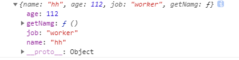

# 对象的创建与继承

## 1. 创建对象

**首先需要知道的是使用原型的继承模式进行创建对象的意义，虽然可以使用 Object 构造函数或对象字面量可以方便地创建对象，但是这些方式在创建具有同样接口的多个对象时需要重复编写很多代码。然后需要知道的是 ECMAScript6 开始支持类和继承，但是ES6 的类更像是封装了 ES5.1 构造函数加原型继承的语法糖而已**

### 1.1 工厂模式

封装一个函数，接收对象所需的参数，return 一个对象

```js
function creatObj(name, age, job) {
    let o = new Object();
    o.name = name;
    o.age = age;
    o.job = job;
    o.getNamg = function () {
        console.log(this.name);
    };
    return o;
}

const obj1 = creatObj('hh', 112, 'worker');
console.log(obj1);
```

`obj1` 打印结果如下


